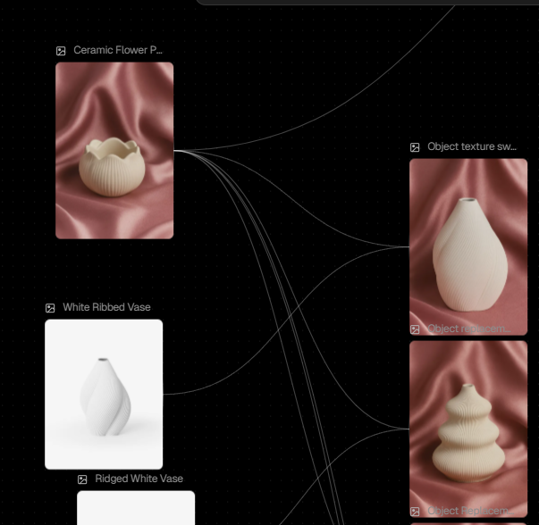

  <!-- Replace with your project banner/logo -->
  

  <h1>🌸 Sakura</h1>

  

    <em>Heaven is Home...</em>
  

  

    <a href="https://sakura-kohl.vercel.app/">View Live Demo</a> &nbsp;·&nbsp;
    <a href="https://youtu.be/fzCxU0essoc">
       
      View Showcase Video on Youtube
    </a>
  

  <!-- Badges -->
  

    
    
    
    
    
    
    
  

---

<!-- SCREENSHOTS / PREVIEW -->
## 📸 Preview

<!-- Add screenshots or GIFs showcasing your project -->
<!-- Use GIFs for animation-heavy projects — they speak louder than static images -->

  
  
  

<!-- Optional: multiple screenshots -->
<!--

  
  

-->

---

<!-- TABLE OF CONTENTS -->
## 📋 Table of Contents

- [About The Project](#-about-the-project)
- [Brand Direction](#-brand-direction)
- [AI-Powered Workflow](#-ai-powered-workflow)
- [Project Evolution](#-project-evolution)
- [Tech Stack](#-tech-stack)
- [Features](#-features)
- [Lessons Learned](#-lessons-learned)
- [Roadmap](#-roadmap)
- [Contact](#-contact)
- [Acknowledgments](#-acknowledgments)
- [License](#-license)

---

<!-- ABOUT THE PROJECT -->
## 🎯 About The Project

### Problem & Solution Statement
<!-- What problem does this project solve? -->
-Most e-commerce websites nowadays are repetitive and boring,
focusing only on utility while sacrificing brand soul.
-The challenge was to break this cycle by creating an immersive digital experience — one that doesn't just sell a product,
but leaves a lasting impression through fluid motion and thoughtful design.

### Key Highlight

<!-- What makes this project special? -->

- 100% Solo-Led Brand & Dev: Everything you see—from the brand direction, visual identity, and target audience to the final line of code—was conceptualized and implemented solely by me.
- Unique Digital Experience: Designed to be more than just a store, it's an emotive journey crafted to touch users and leave a lasting impression.
- Continuous Evolution: This project isn't just a "one-off"; it has been continuously refined over months, evolving from a Vite/SCSS site to a full-scale modern Next.js application.
- AI-Creative Workflow: Entire brand voice and assets generated and curated using advanced AI tools, all meticulously guided and refined by me.
---

<!-- BRAND DIRECTION -->
## 🎨 Brand Direction

> **This project was built from the ground up — not just the code, but the entire brand identity.**

### Vibes & Mood

<!-- What feeling/aesthetic did you go for? -->
The core idea of Sakura was to sell gypsum products as a Decor. For me, 'Decor' means 'Home,' and that was the spark for this entire journey. The goal was to capture the essence of home vibes — comfort, warmth, and relaxation. It’s about creating a cozy family sanctuary with a subtle touch of luxury, a vision that immediately drove me to start this project.

  
  
  <!--  -->

### Color Palette

<!-- Your color choices and their reasoning -->

| Color | Hex | Usage |
|-------|-----|-------|
| Dust Grey | `#D8CFC4` | Backgrounds and neutral textures to provide a clean, organic canvas. |
| Shadow Grey | `#1C1F2A` | Typography and deep contrast elements for a premium, grounding feel. |
| Rosy Taupe | `#C78F94` | Secondary accents and soft UI elements to bridge warmth and luxury. |
| Burnt Rose | `#8B4B4B` | Primary brand color, used in backgrounds of products' images for key highlights to evoke emotional warmth. |

### Target Audience
<!-- Who is this for and why? -->
Since Decor means Home, my heart belongs to Families. I targeted parents who navigate long, demanding days—balancing work, children, and home life. After the chaos, they deserve a moment of pure silence and sanctuary. Sakura is for those who seek to reclaim their peace at the end of every day.

### Product Photography Direction
<!-- How did you direct the product photography set? What was the vision? -->
The vision was 'Luxury meets Comfort.' I chose silk and satin backgrounds to provide a sophisticated, high-end feel that remains soft and inviting. I initially experimented with Bronze tones, but theyfelt too heavy and restrictive. I immediately pivoted to a Burnt Rose aesthetic, which perfectly captured the 'warm-lux' balance I was looking for.

### Copywriting
<!-- How did you supervise/guide the copy? What tone did you go for? -->
Every word was chosen to serve the 'Home Sanctuary' vibe. Starting from the Slogan of the brand "Heaven Is Home" The copywriting focuses on reminding the user that Home is the best part of the day. it’s a quiet place where you’re invited to leave your daily troubles at the door and immerse yourself in tranquility.

---

<!-- AI-POWERED WORKFLOW -->
## 🤖 AI-Powered Workflow

> AI was an important part of my workflow — not just for coding, but across the entire creative process.

| Area | Tool | How I Used It |
|------|------|---------------|
| Products' Images | Flora.ai | Guided and refined the generation of high-end product visuals, ensuring they perfectly matched the vibes desired. |
| Copywriting | ChatGpt | Brainstormed and iterated on brand tone to create an emotional connection. |
| Development | Antigravity and VScode Copilot | Pair programming for logic optimization and accelerating the transition from a Vite-based project to a modern Next.js 16 stack. |

<!-- Optional: Add before/after examples or AI-generated assets showcase -->
### AI-Generated Assets Showcase

  
  <!--  -->

---

<!-- PROJECT EVOLUTION -->
## 🔄 Project Evolution
> **Note:** While this project might not look like a "first ever project for someone," the current version is the result of months of continuous refinement and a complete architectural overhaul.
### V1 — The Learning Phase
<table>
  <tr>
    <td><strong>Timeline</strong></td>
    <td>Finished Mid-August 2025</td>
  </tr>
  <tr>
    <td><strong>Stack</strong></td>
    <td>React + Vite + SCSS + Framer Motion</td>
  </tr>
  <tr>
    <td><strong>Status</strong></td>
    <td>✅ Completed</td>
  </tr>
</table>
### V2 — The Professional Rebuild
<table>
  <tr>
    <td><strong>Timeline</strong></td>
    <td>Late October 2025 – Present</td>
  </tr>
  <tr>
    <td><strong>Stack</strong></td>
    <td>Next.js 16 + Tailwind CSS 4 + TypeScript + GSAP</td>
  </tr>
  <tr>
    <td><strong>Status</strong></td>
    <td>🔄 Actively Maintained & Enhanced</td>
  </tr>
</table>

### Why I Rebuilt It

- **Mastering New Tech:** There is no better way to learn than rebuilding a project you already know. I revisited the old version and realized how much I could improve.

- **Solving the SEO Gap:** The original React + Vite (CSR) setup was a drawback for e-commerce. Moving to Next.js provided the SEO and performance standards a real brand deserves.

- **Simplified Routing & Architecture:** Next.js's App Router replaced the complex React Router setup, offering a more intuitive and powerful way to handle dynamic pages.

- **Scalability & Production Readiness:** By implementing SSR (Server-Side Rendering) and ISR (Incremental Static Regeneration), I ensured the project is ready for any backend integration without "reinventing the wheel."

- **Clean Code & Type Safety:** Adopting TypeScript brought the project up to professional standards, ensuring type safety and fewer bugs.

- **Maintainability (Tailwind vs. SCSS):** My SCSS code had become a "maze" of complex nesting and messy hardcoded values (e.g., margins like 34.5px). Tailwind CSS provided a clean, utility-first structure that made the design easy to maintain and scale.

- **Advanced Aesthetics:** While V1 used basic Framer Motion, I transitioned to **GSAP** in V2 to add another layer of cinematic depth and professional-grade animations.

### Evolution Timeline

| Date | Milestone |
|------|-----------|
| Jul - Aug 2025 | V1 Launched (First major build) |
| Early Nov 2025 | V2 Next.js rebuild started with Tailwind CSS — TypeScript migration followed later. |
| Feb 2026 | **Supabase Integration:** Implemented a scalable backend for Authintication and handling dynamic product data with seamless dashboard page. |
| Mar 2026 | Advanced GSAP animations & Performance tuning |
<!-- TECH STACK -->
## 🛠 Tech Stack

| Category | Technology |
|----------|-----------|
| **Framework** | Next.js 16 (App Router) |
| **UI Library** | React 19 |
| **Animations** | GSAP 3 + Framer Motion |
| **Styling** | Tailwind CSS 4 |
| **State Management** | Redux Toolkit |
| **Smooth Scroll** | Lenis |
| **Backend / DB** | Supabase |
| **Icons** | Lucide React |
| **Notifications** | React Toastify |

---

<!-- FEATURES -->
## ✨ Features

<!-- List your main features -->

- **Next.js Power:** Leveraging SSR and ISR for lightning-fast performance and SEO.
- **Global State Management:** Seamless cart and favorite functionality using Redux Toolkit.
- **Scalable Backend:** Integrated **Supabase** for seamless product data management and user security.
- **Responsive & Modern Design:** Fully optimized for all devices using Tailwind CSS 4.
- **Immersive GSAP Animations:** High-end motion design for a cinematic retail experience.

---
<!-- LESSONS LEARNED -->
## 🧗 Lessons Learned

🧠 General & Creative Lessons

The Power of Solo Ownership: This project proved that I can handle a full product lifecycle—from business strategy and brand identity to full-stack development. It taught me how to wear multiple hats without losing sight of the core vision.

AI as a Bridge: I learned that AI tools (when guided correctly) significantly shorten the distance between a "dreamed concept" and a "deployable reality." It transformed my workflow from just "coding" to "curating and directing" an entire digital brand.

Iterative Growth (V1 to V2): I realized that the best way to grow is to be your own toughest critic. Choosing to rebuild a working project from scratch taught me more about architecture than starting ten new "small" projects ever could.

💻 Technical Lessons

State Management Discipline: Even though Redux might seem like an overkill for some projects, implementing it here was a valuable exercise in managing complex global states (Cart, Favorites) in a scalable, predictable way.

The Architecture of Reusability: Concepts like "Centralization" and "Custom Hooks" are no longer just terms for me; they are my development standard. Building reusable components and logic ensured that Sakura is not just a website, but a scalable e-commerce engine.

Performance-Driven Motion: Mastering GSAP taught me the delicate balance between high-end aesthetics and browser performance. I learned how to create cinematic, timeline-based animations that feel "expensive" without being "heavy."

TypeScript as a Safety Net: Transitioning to TypeScript mid-way through V2 showed me how type-safety acts as a second brain, catching errors before they happen and making the code inherently self-documenting.

<!-- ROADMAP -->
## 🗺 Roadmap

- [ ] **Payment Integration:** Integrate Stripe or PayPal for a complete checkout flow.
- [ ] **Multi-language Support (i18n):** Adding Arabic/English toggle to reach a wider audience.
- [ ] **PWA Support:** Making the website installable on mobile devices for a native app feel.

---

<!-- CONTACT -->
## 📬 Contact
Phone: 01147513119

Email: mosaeed162005@gmail.com

LinkedIn: https://www.linkedin.com/in/mohamed-saeeed-609451317/

Upwork: https://www.upwork.com/freelancers/~01c5b6713470336779

<!-- Your Name -->
**Mohamed Saeed Attia**

<!-- Your links -->

  
  
  
  

**Project Link:** [(https://sakura-kohl.vercel.app/](https://sakura-kohl.vercel.app/))

---
<!-- ACKNOWLEDGMENTS -->
## 🙏 Acknowledgments

<!-- Resources, inspirations, or people you want to credit -->

- My Family ❤

---
## 📜 License

This project, its assets, and the case study content are licensed under **CC BY-NC-ND 4.0**. See the [LICENSE](LICENSE) file for details.

---

  
Made with ❤️ by <a href="">Mohamed Saeed</a>

