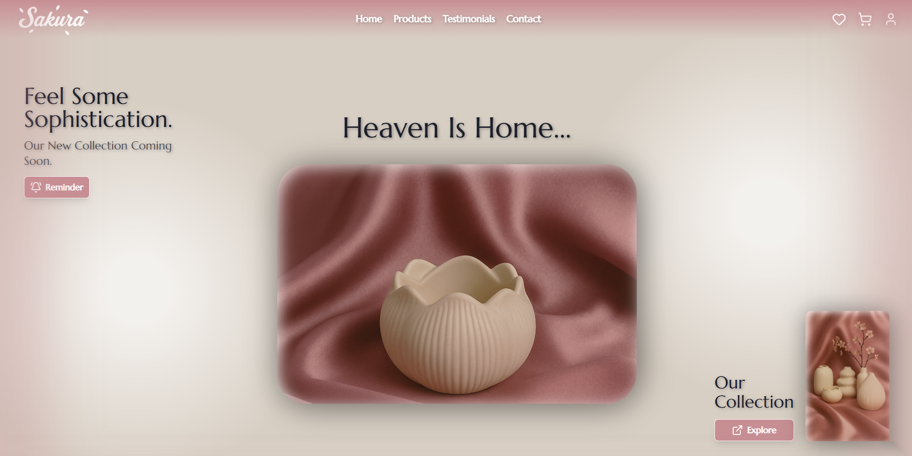
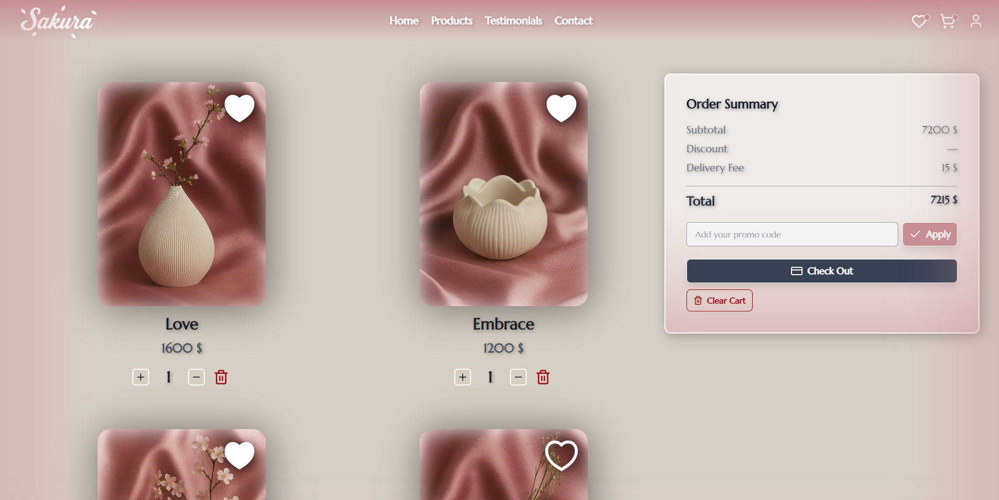

Sakura: Heaven Is Home...
A Journey from Code to Craft - Lead Developer & Creative Director

Sakura: The Art of Handcrafted Living 🌸

📸 0. The Hook
TIP

ابدأ بصورة "Hero" للمشروع أو فيديو Screen Recording يوضح الأنيميشن، واكتب جملة قوية عن "Sakura" كبراند مش مجرد موقع.

🎭 1. My Role: The Dual Perspective
في الجزء ده، لازم تبرز إنك "Fullstack Creative".

Creative Director: المسؤول عن الهوية البصرية، اختيار الألوان (Palette)، الـ Vibes، وفلسفة الـ Brand.
Lead Developer: المسؤول عن بناء المعمارية البرمجية وتحويل الرؤية الفنية لواقع تقني.
🚀 2. The Evolution (Vite to Next.js)
هنا احكي عن "الرحلة التقنية":

The Prototype (Vite + SCSS): البداية كانت سريعة كـ MVP لاستكشاف الأفكار.
The Modern Stack (Next.js + TS + Tailwind): ليه قررت تعيد بناء المشروع بالكامل؟
السرعة (Performance).
الـ SEO (لأن ده براند تجاري محتاج يظهر للناس).
الـ Scalability (القابلية للتوسع).
الأمان والنوعية (Type Safety) باستخدام TypeScript.
✨ 3. The Edge: Brand Direction & Identity
دا الجزء اللي بيميزك عن أي مبرمج تاني:

Visual Identity: اختيار الألوان الهادئة اللي بتوحي بالـ "Sanctuary" والراحة.
Photography & Art Direction: إزاي نسقت جلسات تصوير المنتجات (أو اختيارها) عشان تتناسب مع الـ Flow بتاع الموقع.
Copywriting: الكتابة الإبداعية اللي بتهدف لعمل "Emotional Connection" مع العميل.
Motion Identity: إزاي خليت الـ Animation مش مجرد "زينة"، لكن جزء من تجربة المستخدم (UX).
🛠️ 4. Technical Deep Dive (Challenges & Solutions)
اختار أهم مشكلتين واجهتنا وحلناها (بأسلوب المهندس):

Challenge: تنسيق الـ Smooth Scroll (Lenis) مع الـ Page Transitions (Framer Motion) في Next.js.
Solution: استخدام الـ onExitComplete والـ Frozen Children Pattern لضمان تجربة سكرول احترافية خالية من الـ Flicker.
Challenge: تنظيف الكود وتنظيم معمارية المشروع (Clean Architecture).
Solution: إعادة هيكلة المشروع لـ hooks, 
lib
, store, و components لضمان سهولة الصيانة مستقبلاً.
💎 5. The Outcome & Key Features
Fluid UI: حركات انسيابية بـ GSAP.
Responsive Nature: تجربة مثالية على الموبايل والديسكتاب.
Full Commerce Experience: من الـ Product Discovery لحد الـ Checkout.
🔚 6. Reflection
جملة نهائية عن اللي تعلمته من المشروع ده، وإزاي رؤيتك كمصمم ومبرمج اندمجت مع بعضها.

IMPORTANT

نصيحة ليك وإنت بتكتب: حاول تستخدم كلمات زي "Sanctuary", "Seamless", "Craftsmanship". الكلمات دي بتعكس روح المشروع جداً.

Comment
Ctrl+Alt+M

# 🌸 Sakura
Elegant e-commerce platform for premium home décor with smooth animations, shopping cart, and favourites functionality , dynamic filtering and products page .

---

## 🔗 Live Demo
**https://sakura-kohl.vercel.app/** 

---

## 📸 Screenshots

.mp4)
<video controls width="600">
  <source src="./sakuravid.mp4" type="video/mp4">
</video>

---

## ✨ Features
- Interactive product catalog with filtering & search
- Persistent shopping cart with quantity management
- Wishlist/favorites system
- Smooth page transitions & micro-interactions
- Glassmorphism UI with scroll animations
- Fully responsive design
- LocalStorage data persistence

---

## 🛠️ Tech Stack
- **Next.js 14**
- **TypeScript**
- **Redux Toolkit**
- **Framer Motion**
- **Tailwind CSS**

--------------------
